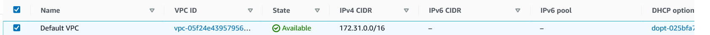
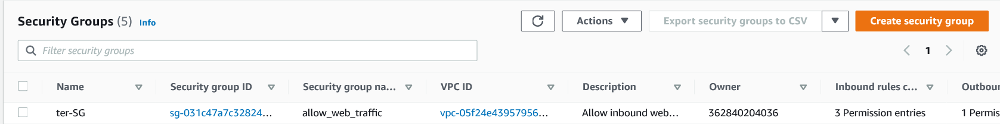
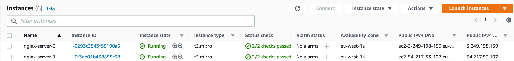
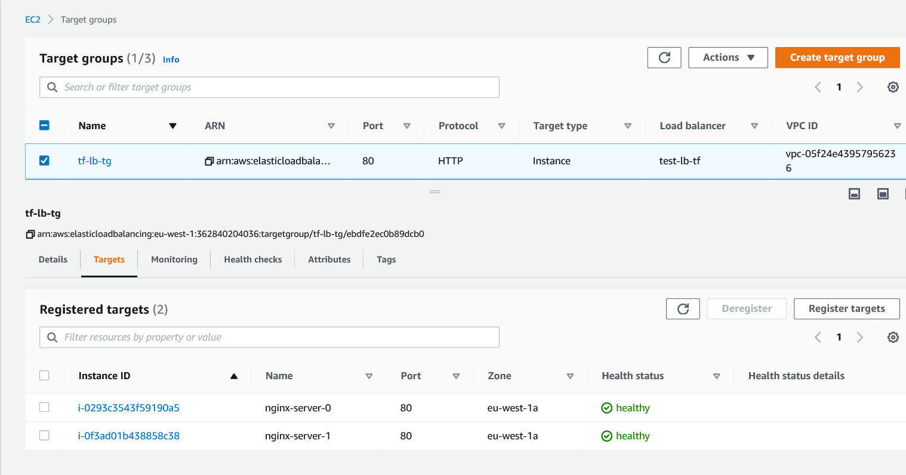
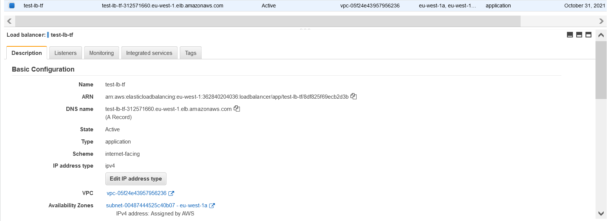
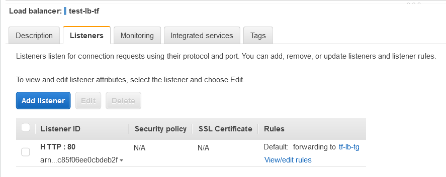
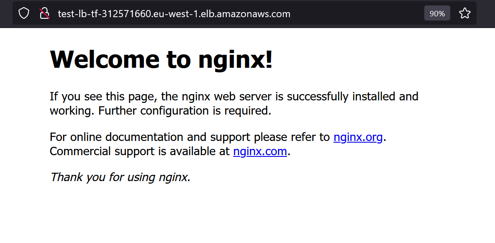

# What is Terraform?
Terraform is an IaC tool that lets you build, change, and version infrastructure safely and efficiently. In addition, it has [great documentation](https://www.terraform.io/).

Terraform supports different cloud providers such as Alibaba, AWS, GCP, Microsoft Azure, PaaS, and more. Each provider exposes its own API interactions and resources. Think of a resource like a VM, VPC, Subnet, Cluster, etc.  
## Install and Configure
To install Terraform:

1. Find the package for your system [here](https://www.terraform.io/downloads.html) and download it. Terraform is packaged as a zip archive. 

2. Unzip the package. Terraform runs as a single binary named terraform.  

3. Make sure that the terraform binary is available on the PATH.

4. If you don’t have an AWS account, create an AWS [free-tier](https://aws.amazon.com/free/) account.
# AWS Terraform Project
 This terraform project creates quickly two servers with [NGINX](https://www.nginx.com/) running each, in AWS with the default VPC.
 Furthermore it produces an [Application Load Balancer](https://docs.aws.amazon.com/elasticloadbalancing/latest/application/introduction.html) that forwards the users’ traffic to the server.

## Use it
- clone this repo
    ```git clone https://github.com/assiakhateeb/aws-terraform.git```
- Modify `variables.tf` with your own  information
## Code Commit
1. Initialization (Installation of provider libraries) 
`terraform init`
2. Check results of script before applying changes
`terraform plan`
3. Apply Changes
`terraform apply`

## Providers

| Name | Version |
|------|---------|
| <a name="provider_aws"></a> [aws](https://registry.terraform.io/providers/hashicorp/aws/latest/docs) | Terraform 0.13 and later |


## Resources

| Name | Type |
|------|------|
| [aws_default_vpc](https://registry.terraform.io/providers/hashicorp/aws/latest/docs/resources/default_vpc) | resource |
| [aws_subnet_ids ](https://registry.terraform.io/providers/hashicorp/aws/latest/docs/data-sources/subnet_ids) | data source |
| [aws_security_group](https://registry.terraform.io/providers/hashicorp/aws/latest/docs/resources/security_group) | resource |
| [aws_ami ](https://registry.terraform.io/providers/hashicorp/aws/latest/docs/data-sources/ami) | data source |
| [aws_instance](https://registry.terraform.io/providers/hashicorp/aws/latest/docs/resources/instance)  | resource |
| [aws_lb_target_group](https://registry.terraform.io/providers/hashicorp/aws/latest/docs/resources/lb_target_group)  | resource |
| [aws_lb_target_group_attachment](https://registry.terraform.io/providers/hashicorp/aws/latest/docs/resources/lb_target_group_attachment)  | resource |
| [aws_lb](https://registry.terraform.io/providers/hashicorp/aws/latest/docs/resources/lb)  | resource |
| [aws_lb_listener](https://registry.terraform.io/providers/hashicorp/aws/latest/docs/resources/lb_listener)  | resource |

### Default VPC


### Security Group 


### Instances


### Target Group


### Load Balancer


## Listener


## NGINX
* Copy Load Balancer DNS name and paste it in your own browser.
You'll get this page: 

